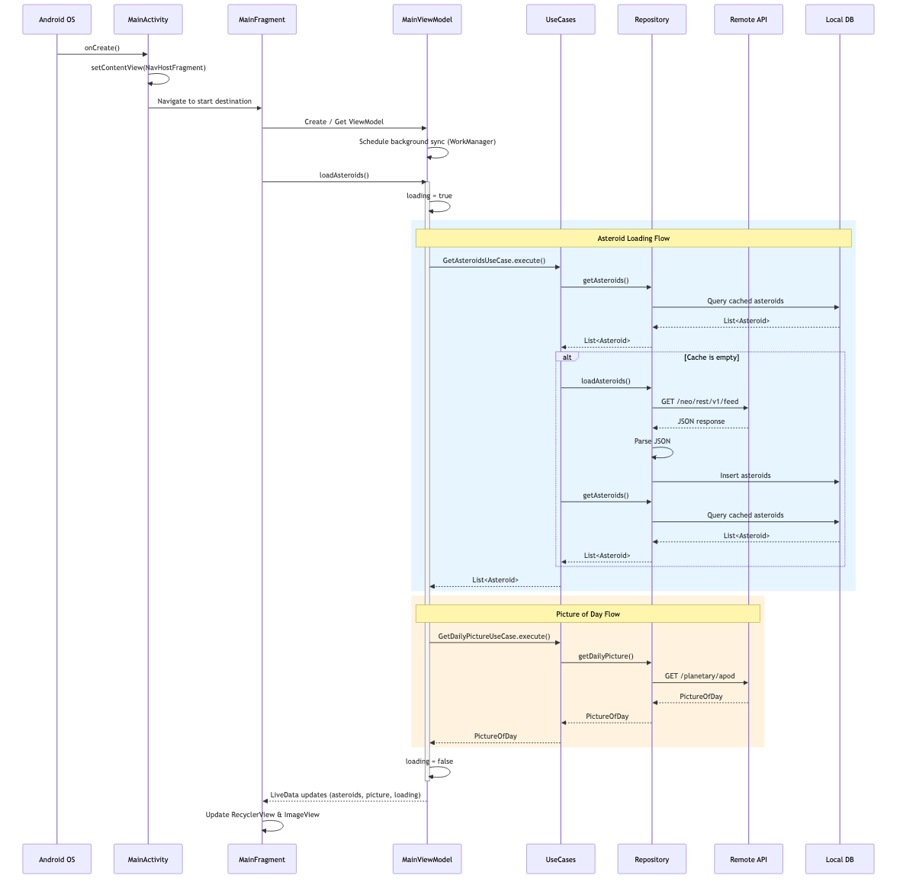

# Asteroid Radar App

A modern Android application built with Kotlin that displays real-time asteroid data from NASA's Near-Earth Object API. The app provides users with information about asteroids passing near Earth, including detailed asteroid properties and the Astronomy Picture of the Day.

## Table of Contents

- [Features](#features)
- [Project Setup](#project-setup)
- [Architecture](#architecture)
- [Sequence Diagram](#sequence-diagram)
- [Tech Stack](#tech-stack)
- [API Configuration](#api-configuration)
- [Project Structure](#project-structure)
- [Building and Running](#building-and-running)
- [Key Components](#key-components)

## Features

- 📱 Display a list of nearby asteroids
- 🔍 View detailed asteroid information
- 🖼️ Astronomy Picture of the Day feature
- 🌐 Real-time data from NASA API
- 💾 Local caching with Room database
- 🔄 Background data synchronization with WorkManager

## Project Setup

### Prerequisites

- Android Studio (latest version recommended)
- JDK 11 or higher
- An internet connection for API calls

### Installation Steps

1. **Clone the repository**
   ```bash
   git clone <repository-url>
   cd asteroid-radar
   ```

2. **Build the project**
   ```bash
   ./gradlew build
   ```

3. **Run on an emulator or device**
   ```bash
   ./gradlew installDebug
   ```

### Android Requirements

- **Minimum SDK**: API 24 (Android 7.0 Nougat)
- **Target SDK**: API 35 (Android 15)
- **Compile SDK**: API 35
- **JVM Target**: Java 11

## Architecture

The app follows the **MVVM (Model-View-ViewModel)** architecture pattern with a clean separation of concerns:

```
┌────────────────────────────────────────┐
│          UI Layer                      │
│  (MainActivity, MainFrag, DetailFrag)  │
└─────────────────┬──────────────────────┘
                  │
┌─────────────────▼──────────────────────┐
│        ViewModel Layer                 │
│  (LiveData/StateFlow management)       │
└─────────────────┬──────────────────────┘
                  │
┌─────────────────▼──────────────────────┐
│        Domain Layer (Use Cases)        │
│  (Business logic orchestration)        │
└─────────────────┬──────────────────────┘
                  │
┌─────────────────▼──────────────────────┐
│      Repository Layer                  │
│  (AsteroidsRepository)                 │
│  Abstracts data sources                │
└────────────────┬───────────────────────┘
                 │
     ┌───────────┴──────────┐
     │                      │
┌────▼──────────┐  ┌────────▼─────────┐
│  API Layer    │  │  Database Layer  │
│  (Retrofit)   │  │  (Room)          │
└───────────────┘  │  Local cache     │
                   └──────────────────┘
```

### Sequence Diagram

The following diagram illustrates the main app flow from launch to data display:



### Layer Responsibilities

- **UI Layer**: Handles user interactions and displays data using data binding
- **ViewModel Layer**: Manages UI state and business logic, survives configuration changes
- **Domain Layer**: Contains use cases that encapsulate business logic
- **Repository Layer**: Provides a single source of truth for data, handles caching strategy
- **API Layer**: Manages HTTP requests to NASA's API using Retrofit
- **Database Layer**: Handles local data persistence using Room

## Tech Stack

| Category | Components                                   |
|----------|----------------------------------------------|
| **UI** | DataBinding, AppCompat, RecyclerView         |
| **Networking** | Retrofit, Moshi, OkHttp                      |
| **Data Persistence** | Room                                         |
| **Lifecycle & Architecture** | ViewModel, LiveData, Navigation, WorkManager |
| **Image Loading** | Picasso                                      |
| **Async** | Kotlin Coroutines                            |
| **Testing** | JUnit, Espresso, Robolectric, MockWebServer  |

## API Configuration

### NASA Near-Earth Object API

The app integrates with NASA's publicly available API for asteroid data.

**Base URL**: `https://api.nasa.gov/`

**API Key**: Configured in `app/build.gradle.kts`
```gradle
buildConfigField("String", "NASA_API_KEY", "\"your-api-key-here\"")
```

### Permissions

The app requires the following permissions (declared in `AndroidManifest.xml`):

- `android.permission.INTERNET` - For API calls
- `android.permission.ACCESS_WIFI_STATE` - For network state checking

## Project Structure

```
app/src/main/java/com/viv/asteroidradar/
├── AsteroidRadarApplication.kt       # Application entry point
├── data/                              # Data layer
│   ├── api/                           # Networking (Retrofit, API models, parsing)
│   ├── database/                      # Room entities and DAOs
│   ├── repository/                    # Repository implementations
│   └── worker/                        # WorkManager background tasks
├── domain/                            # Domain layer
│   ├── Asteroid.kt                    # Asteroid domain model
│   ├── PictureOfDay.kt               # APOD domain model
│   └── usecase/                       # Business logic use cases
└── presentation/                      # UI layer
    ├── MainActivity.kt                # Main activity
    ├── BindingAdapters.kt             # Data binding adapters
    ├── main/                          # Main screen (list + view model)
    └── detail/                        # Detail screen
```

## Building and Running

### Using Android Studio

1. Open the project in Android Studio
2. Wait for Gradle sync to complete
3. Select a device or emulator
4. Click **Run** (Shift + F10) or use the menu: **Run > Run 'app'**

### Using Command Line

**Debug Build**:
```bash
./gradlew assembleDebug
./gradlew installDebug
```

**Release Build**:
```bash
./gradlew assembleRelease
```

**Run Tests**:
```bash
./gradlew test
./gradlew connectedAndroidTest
```

**Clean Build**:
```bash
./gradlew clean build
```

## Key Components

### Repository Pattern

`AsteroidsRepository` provides a single source of truth for data:
- Fetches from API if data is not cached
- Stores data in local database for offline access
- Manages refresh strategy (7-day default window)

### Use Cases

Domain use cases encapsulate business logic:
- `GetAsteroidsUseCase` – retrieves cached asteroid data
- `GetDailyPictureUseCase` – fetches the Astronomy Picture of the Day
- `LoadAsteroidsUseCase` – loads and caches asteroid data from the API

### ViewModel

Manages UI state and handles communication between views and repository:
- Uses LiveData for reactive updates
- Survives configuration changes
- Handles coroutines for async operations

### Room Database

Local SQLite database for:
- Caching asteroid data
- Reducing API calls
- Providing offline functionality

### Retrofit Service

HTTP client configuration:
- Base URL: NASA API endpoint
- JSON parsing with Moshi
- Coroutines adapter for async requests

### WorkManager

Background synchronization:
- Periodic data refresh

## Notes

- The app uses **Gradle Version Catalog** (`gradle/libs.versions.toml`) for dependency management
- **Data Binding** is enabled for view-model binding
- **Navigation Safe Args** is used for type-safe fragment navigation
- **KSP** (Kotlin Symbol Processing) is enabled for faster annotation processing
